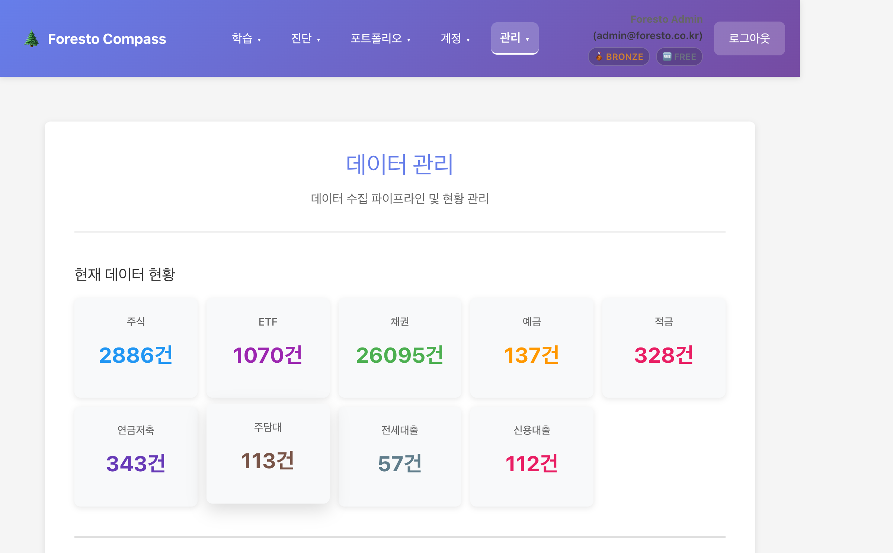
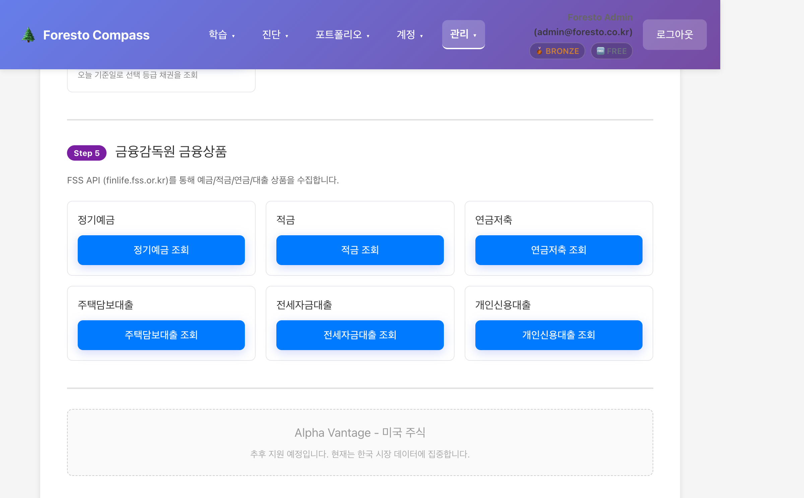

# DataManagementPage UX 정비 변경 내역

**일자**: 2026-02-11
**파일**: `frontend/src/pages/DataManagementPage.jsx`
**코드량**: 1,218줄 → 792줄 (35% 감소)

---

## 1. 헤더 + 데이터 현황



### 변경 사항
- 페이지 부제목을 "데이터 수집 파이프라인 및 현황 관리"로 변경
- 데이터 현황 카드 9개를 `.map()` 루프로 리팩토링 (중복 JSX 제거)
- 카드 최소 너비를 `200px → 140px`로 줄여 한 줄에 5개 표시

---

## 2. Step 1 FDR 종목 마스터 / Step 2 주식-ETF 수집


### 변경 사항
- **FDR 종목 마스터 섹션을 페이지 최하단에서 최상단(Step 1)으로 이동**
  - 이유: 종목 마스터가 모든 수집의 기초 데이터이므로 파이프라인 순서에 맞게 배치
- 각 섹션에 **색상 Step 배지** 추가 (Step 1: 회색, Step 2: 파랑)
- 불필요한 info-box (파란 안내 상자) 제거, 간결한 `<p>` 설명으로 교체

---

## 3. Step 3 pykrx 시계열 데이터


### 변경 사항
- Step 3 배지 (진한 파랑) 추가
- "단일 종목 시계열" / "전체 종목 5년치 증분 적재" 두 서브섹션 유지
- 공통 스타일 변수 (`inputStyle`, `labelStyle`) 적용으로 인라인 스타일 중복 제거

---

## 4. Step 4 재무 / 배당 / 기업액션 / 채권


### 변경 사항
- Step 4 배지 (주황) 추가
- 4개 카드(재무제표, 배당, 기업 액션, 채권)를 한 섹션으로 통합
- **기업 액션 카드**: 기존 날짜 3개 입력(start_date, end_date, as_of_date)을 **연도 + 분기 드롭다운**으로 교체
  - Q1~Q4 및 ALL(전체) 선택 가능
  - 백엔드에서 90일 단위 자동 분할 처리
- 각 카드에 데이터 소스 표시 (DART / 금융위원회 OpenAPI)

---

## 5. Step 5 금융감독원 금융상품 + Alpha Vantage 플레이스홀더



### 변경 사항
- Step 5 배지 (보라) 추가
- **FSS 금융상품 6개 카드를 `.map()` 루프로 통합** (기존 각각 ~30줄 x 6 = 180줄 → 35줄)
  - 정기예금, 적금, 연금저축, 주택담보대출, 전세자금대출, 개인신용대출
- **Alpha Vantage (미국 주식) 섹션 숨김 처리**
  - 기존: 미국 주식/ETF 수집, 시계열 수집, 개별 종목 검색 등 200줄 이상의 UI
  - 변경: 점선 테두리 + 회색 "추후 지원 예정" 플레이스홀더 (6줄)
  - api.js의 Alpha Vantage 함수들은 그대로 보존 (추후 복원 가능)

---

## 6. 적재된 데이터 조회


### 변경 사항
- 기존과 동일한 탭 구조 유지 (주식, ETF, 채권, 예적금)
- DataTable 컴포넌트 연동 그대로 유지

---

## 전체 구조 변경 요약

### Before (기존 순서)
```
1. 헤더 + 데이터 현황
2. yfinance 주식/ETF 수집
3. Alpha Vantage 미국 주식 (200줄+)
4. pykrx 시계열
5. 배당/기업액션/채권/재무제표
6. 금융감독원 FSS
7. FDR 종목 마스터       ← 기초 데이터가 최하단
8. 데이터 조회
```

### After (변경 후 순서)
```
1. 헤더 + 데이터 현황
2. [Step 1] FDR 종목 마스터  ← 파이프라인 첫 단계로 이동
3. [Step 2] 주식/ETF 수집
4. [Step 3] pykrx 시계열
5. [Step 4] 재무/배당/기업액션/채권
6. [Step 5] 금융감독원 FSS
7. Alpha Vantage (준비 중)  ← 숨김 처리
8. 데이터 조회
```

### 코드 개선
| 항목 | Before | After |
|------|--------|-------|
| 파일 줄 수 | 1,218줄 | 792줄 |
| 인라인 스타일 | 모든 요소에 개별 지정 | 공통 변수 6개 추출 |
| FSS 카드 6개 | 각각 30줄 (총 180줄) | `.map()` 루프 35줄 |
| 데이터 현황 카드 9개 | 각각 6줄 (총 54줄) | `.map()` 루프 15줄 |
| Alpha Vantage 섹션 | 200줄 (풀 UI) | 6줄 (플레이스홀더) |
